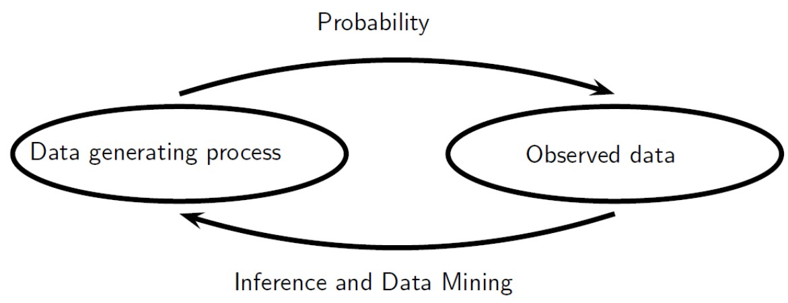

<head>
    
    
</head>

# 统计方向分系介绍

## 分系时该考虑什么

|  学术兴趣 |  专业  |
|  :----:  | :----: |
|  学界的领域划分，稳定  | 每个学校的划分，变化 |
| 长期从事  | 短暂 |
| 研究生，学界，业界 | 毕业要求，排名范围 |

挖掘**学术兴趣**！以此为基础寻找导师、文献、课程等资源及决定从什么小方向毕业。

### 专业

- 数学与应用数学专业：基础、金融、概率
- 统计学专业：统计、生物统计
- 信息与计算科学专业：计算、信息
- 数据科学与大数据技术专业：大数据

### 学术兴趣（举例）

- 统计：高维统计学、生物统计、因果推断、贝叶斯统计……
- 运筹学 (operation research) ：优化、工业工程 (industrial engineering) ……
- 机器学习：深度学习（自然语言处理、计算机视觉、语音识别）、强化学习……
- 计算数学：数值PDE、计算系统生物学、计算流体力学……

## 统计学的研究内容与价值观

统计是处理带有随机性的数据的艺术。人们设计试验并收集数据，然后希望统计学家能通过数据分析来学到一些知识，从而有助于解释和预测。统计学家致力于构建数学的理论，基于概率模型提出研究数据的方法。

> **数据 → 模型 → 算法 → 推断**

- **数据收集**：抽样调查，试验设计……（当然，大数据时代很多数据是已经帮你收集好了，现在人们已经更为关注数据分析）。

- **模型**：参数模型/非参数模型，线性/广义线性模型，神经网络，概率图模型，深度生成模型……

- *All models are wrong, but some are useful.* (George E. P. Box) 学过统计以后大家会对这句话有更深的理解。统计的宗旨即是用数据和（不一定准确的）模型来认识世界。

- **算法**：凸优化，EM (Expectation-Maximization) ，MCMC (Markov Chain Monte Carlo，马尔科夫链蒙特卡洛)，VI (Variational Inference，变分推断) ……

- 计算机的发明和广泛应用使统计学的研究发生了翻天覆地的变化。例如，如果没有计算机，一般的贝叶斯后验分布的采样即为困难，贝叶斯学派也无法发展成能与频率学派分庭抗礼的一大分支。

- **推断**：从数据中得出什么信息？如数据的分布、不同变量之间的相关性与因果性等，并期望从已有的数据中预测新的数据分布。

- A priori v.s. A posteriori：前者“由因及果”，如概率；后者“由果及因”，如统计。

<!-- (A priori knowledge is independent from current experience (e.g., as part of a new study). Examples include mathematics, tautologies, and deduction from pure reason. A posteriori knowledge depends on empirical evidence. Examples include most fields of science and aspects of personal knowledge.) -->

## 概率与统计的关系

以下语句及图片引自[*All of Statistics: A Concise Course in Statistical Inference*](https://link.springer.com/book/10.1007/978-0-387-21736-9) ，Larry Wasserman著。

- Part I of the text is concerned with **probability theory**, the formal language of uncertainty which is the basis of statistical inference. The basic problem that we study in probability is:

  > Given a data generating process, what are the properties of the outcomes?

- Part II is about **statistical inference** and its close cousins, **data mining** and **machine learning**. The basic problem of statistical inference is the inverse of probability:

  > Given the outcomes, what can we say about the process that generated the data?

- 概率：若$X_t\sim\mathcal{P}$，它会有怎样的性质？

- 统计：给出数据$X_1,...,X_n\sim\mathcal{P}$，如何对这个分布$\mathcal{P}$做一些推断？

## 统计与机器学习

> **统计之都**：您认为统计与机器学习的关系到底是什么？您是如何看待的？
>
> **张志华**：我个人认为没有本质上的区别。而且现在很多人认为：机器学习是现代统计学；机器学习是统计和计算机科学的一个交叉融合。当然两个学科的出发点可能不一样，计算机没出现的时候，我们就有统计了，已经在做数据分析了；而机器学习是伴随计算机发展而发展起来的，它最开始的目的是让计算机具有学习能力，但是后来转变思路，要从数据里构造算法，然后基于算法做预测或决策，这个目的和统计实际上是一样的，**都是希望从数据中产生价值，殊路同归**。两者都需要计算技术和方法。但是因为学科的不同起源，理论关注的角度有些不一样。**统计可能更偏向于模型，常用分析的数学手段；而计算机更强调的是计算，常用组合的数学手段**。比如说计算机侧重研究的是计算的复杂度、有效性；统计研究这个方法的时候，理论则强调相合性、渐进正态性，但两者往往都用概率做工具。当然各自发展起来的理论相互都应该兼容并收。
>
> 以上内容引自[统计之都访谈第43期：孤峰顶上求大道，红尘浪里取乾坤——张志华访谈](https://cosx.org/2022/04/interview-of-zhihua-zhang/)。

## 课程及推荐书目

课程包括各种统计/机器学习相关的课程，统计学培养方案内外均有。

1. 入门内容：概率论、数理统计。
    - 扎实的概率论基础是后续研究的关键。
    - 数理统计推荐书目：
        - 入门：
            - George Casella and Roger L. Berger, *Statistical Inference*.
            - Larry Wasserman, *All of Statistics: A Concise Course in Statistical Inference*.
            - 非常不推荐使用贵校数理统计的标准教材（陈家鼎，孙山泽，李东风，刘力平，《数理统计学讲义》）。此书写作风格过于晦涩，初学者不易读懂，且内容较为陈旧。
        - 进阶（需了解测度论）：
            - Jun Shao, *Mathematical Statistics*.

2. 分析基础课程：实变函数、泛函分析。
    - 实变函数跟测度论重合较大，如果嫌麻烦想一步到位可以直接看Gerald B. Folland, *Reak Analysis*的前三章。
    - 统计里会用到的泛函分析最主要的是RKHS (Reproducing kernel Hilbert space，再生核Hilbert空间) ，最好还是学一下吧。

3. 理论统计进阶课程：测度论、高等概率论、高等统计学。
    - 测度论是把数理统计的内容严格讲清楚的必备工具。
    - 高等统计学相当于数理统计的测度论版本，如果先学测度论再学数理统计的话建议用Jun Shao, *Mathematical Statistics*一步到位。

4. 随机过程相关：应用随机过程、应用随机分析、随机过程论、随机分析。
    - 应用随机过程除Markov链的理论在MCMC中有用之外别的对统计价值不大（这门课随机微分方程几乎不讲）。
    - 学习SDE推荐教材：
        - Bernt Øksendal, *Stochastic Differential Equations*.
        - Weinan E, Tiejun Li, Eric Vanden-Eijnden, *Applied Stochastic Analysis*.

5. 经典统计：应用回归分析、应用多元统计分析、非参数统计、现代统计模型。
    - 前三门课适当地学一点是有必要的，但过于古典，大数据时代并非主流。（虽然如此，一点都不懂也是不好的。）
    - 推荐书目：
        - Toy学长的[应用多元统计分析笔记](https://zhuanlan.zhihu.com/p/91593024)和[现代统计模型笔记](https://zhuanlan.zhihu.com/p/106896222)。

6. 机器学习：机器学习基础。
    - 这门课算是入门课，主要介绍经典机器学习算法。
    - 推荐书目：
        - 李航，*统计学习方法*。
        - 周志华，*机器学习*。
        - Trevor Hastie, Robert Tibshirani, Jerome Friedman, *The Elements of Statistical Learning*.
    - **对机器学习感兴趣的同学，强烈推荐贵校信科部分学生制作的这个网站 (<https://csdiy.wiki/>) ！**

7. 理论机器学习：高维概率论、机器学习（信科）、数据科学导引、高维统计学II。
    - 与上面一条区分，这些课会着重讲机器学习中的理论，重数学原理而（相对）轻上机实验。
    - 推荐书目：
        - Mehryar Mohri, Afshin Rostamizadeh, Ameet Talwalkar, *Foundations of Machine Learning*. （非常难啃，不建议入门用这本）
        - Trevor Hastie, Robert Tibshirani, Jerome Friedman, *The Elements of Statistical Learning*.
        - Shai Shalev-Shwartz, Shai Ben-David, *Understanding Machine Learning: From Theory to Algorithms*.
        - Francis Bach, *Learning Theory from First Principles*.
        - Roman Vershynin, *High-Dimensional Probability*. （高维概率论入门，无需测度论）
        - Roman van Handel, *Probability in High Dimension*. （高维概率论进阶）
        - Martin Wainwright, *High-Dimensional Statistics*.
        - Toy学长的[高等统计学II笔记](https://zhuanlan.zhihu.com/p/345935324)。

8. 贝叶斯统计、计算统计学、深度学习：统计模型与计算方法、贝叶斯理论与计算、深度生成模型（信科）。
    - 推荐书目及课程：
        - Andrew Gelman, John Carlin, Hal Stern, David Dunson, Aki Vehtari, Donald Rubin, *Bayesian Data Analysis*.
        - 张成老师[统计计算](https://zcrabbit.github.io/courses/smcm-f21.html)和[贝叶斯](https://zcrabbit.github.io/courses/btc-s22.html)的课件。
        - Ian Goodfellow, Yoshua Bengio, Aaron Courville, *Deep Learning*.
        - [Stanford CS231n](http://cs231n.stanford.edu/).

9. 强化学习：强化学习（信科）、深度强化学习（信科）。

10. 优化相关：凸优化。
    - 现代机器学习、深度学习中必有对损失函数的优化，因此掌握一些基本算法及其分析而不是只会调包是很重要的。
    - 推荐书目：
        - Stephen Boyd, Lieven Vandenberghe, *Convex Optimization*.

11. 因果推断：统计和生物统计中的因果推断。

12. 生物统计相关：生物统计、计算系统生物学，以及部分生科课程。

13. 函数型数据分析。北大暂时没有相关课程，但是[姚方](https://www.math.pku.edu.cn/teachers/yaof/index.html)老师是此方面的专家。
    - 推荐书目：
        - Toy学长的[函数型数据分析笔记](https://zhuanlan.zhihu.com/p/77203545)。

14. 其他：抽样调查、试验设计。

15. 编程。
    - 现代统计研究几乎离不开编程（纯理论除外），一般的统计分析多用`R`，机器学习多用`Python`，其他的语言（如`Matlab`和`C`）不常用。
    - 按照惯例，统计系学生的码力显著弱于计算系的学生，主要还是因为统计的课大多不需要大规模写代码，而且即使要写大多数情况也是调包，很少有像数值代数、数值分析这些课一样写很底层的算法。
    - 当然，编程语言具体怎么用，数院的课上肯定不会讲（信科有一门“Python程序设计与数据科学导论”挺不错，但任务量极大），有赖于自学。一般来说入门先学个大概就行，具体细节用的时候不会再查说明。如果想实习的话，建议精通至少一门编程语言。

## 关于北大数院统计系和北大统计中心

优势：数院的学生普遍数理基础扎实；统计中心还有不少做生物统计、公共卫生、金融统计、环境统计等方向的老师，师资力量较强。

不足：课程普遍比较古典，前沿课程数量不够。如果想未来在学术上有非常好的发展还是建议出国。

## 本研

大二开始可以找感兴趣的老师聊聊，看看人家的研究方向如何，如果想跟人家做研究需要学哪些知识。

> **统计之都**：对于以后有志于科研的学生您有什么建议？
>
> **张志华**：一是要和老师多多交流，但老师和学生是平等的，老师说的话学生也要有自己的判断，不能说什么就听什么。然后就是同学之间要形成良好的氛围，大家一起，比如说我看到一本有意义的书，大家可以组织一个读书会。每周大家一起过一下书内容，把书难题讨论一下，这样子可以互相促进。对于本科生，解决问题不是首位，最重要的是知识的积累。同时尝试找到可以合作的志同道合朋友。
> 
> 以上内容引自[统计之都访谈第43期：孤峰顶上求大道，红尘浪里取乾坤——张志华访谈](https://cosx.org/2022/04/interview-of-zhihua-zhang/)。

- 经典统计：林伟，姚方，陈松蹊（光华）
- 贝叶斯统计、深度学习：张成
- 生物统计：周晓华，邓明华，席瑞斌
- 金融统计：陈松蹊（光华），李辰旭（光华）
- 环境统计：陈松蹊（光华）
- 因果推断：苗旺，周晓华
- 理论机器学习：张志华，吴磊，董彬，王立威（信科）
- 强化学习：张志华
- ……

## 结语

> *Statistical thinking will one day be as necessary a qualification for efficient citizenship as the ability to read and write.* (H. G. Wells, *Mankind in the Making*, 1903. Remarked and shortened by Samuel Wilks during his presidential address to the American Statistical Association in 1951.)

欢迎大家将统计学及相关领域作为自己的专业选择，加入数院统计系！

## 致谢

本讲稿部分内容参考了舒亦展学长在2020年做的统计学方向分系介绍以及[李通宇学长的知乎文章](https://www.zhihu.com/people/chun-cui-8-18/)，在此致谢。

| **<a href="/index.html">返回</a>** | **最后更新：2022年4月17日** |
